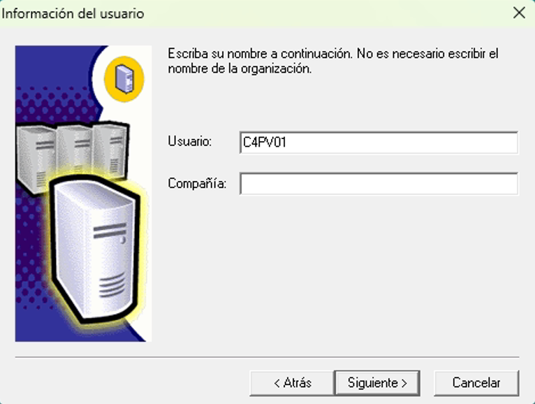
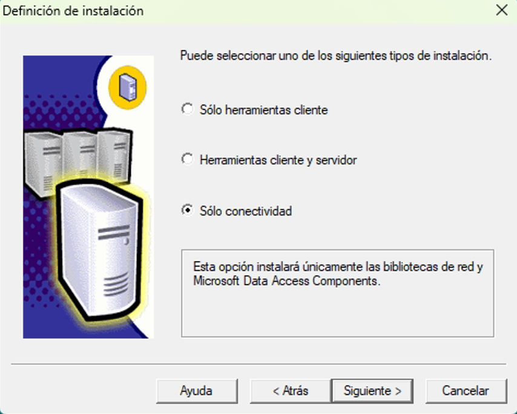

# Instalación

Sigue estos pasos para instalar PECANO en tu entorno de desarrollo:

## Instalar SQL Server

Dirígete a la siguiente ruta:

  ```
  PECANO/SQL Server 2000 Personal/x86/setupsql.exe
  ```

- Hacer clic derecho en `setupsql.exe` > **Propiedades** > **Compatibilidad**
- Ejecutar este programa en modo de compatibilidad `Windows XP (Service Pack 2)`
- Habilitar `Ejecutar este programa como administrador`

Luego de aplicar los cambios y aceptar la configuracion

- Ejecutar `setupsql.exe` como administrador

!!! warning "Advertencia"
    Seguramente aparecerán errores durante la instalación de SQL server. Reiniciar el equipo y volver a ejecutar el instalador solo una vez mas


{ width="350" }
/// caption
Este paso consiste en ingresar los datos básicos del usuario, seleccioanr **Siguiente**.
///

{ width="350" }
/// caption
Aquí se define el tipo de instalación. Selecciona la opción **Solo Conectividad**.
///

---

## Instalar Pecano

Dirígete a la siguiente ruta:
    ```
    Instalador Pecano/INSTALADOR_PECANO
    ```

- Ejecuta el archivo `INSTALADOR_PECANO` como **administrador**.

!!! note "Contraseña requerida"
    Durante la instalación se solicitará una contraseña. Ingrésala cuando se te indique:
    ```
    1234567
    ```

- Ejecuta el archivo `ConexionPecano_ERPBusiness` como **administrador**.

!!! note "Contraseña generada automáticamente"
    La contraseña se genera en base a la hora actual del sistema (momento de ejecución), siguiendo esta fórmula:
    `(Hora + Mes)(Día)(Minuto)`  
    A continuación, se muestra la contraseña en tiempo real. Puede actualizarse manualmente con el botón para reflejar la hora exacta.
    


- Cuando se solicite el nombre del servidor central, utilice: 
!!! note "Nombre del servidor central"
    ```
    SCCEEC-TCN
    ```
---

## Actualizar Pecano (con versión actual)

Para actualizar pecano realiza los siguientes pasos :

- Copiar archivos de la nueva versión a:
    ```
    C:/Aplicaciones/Componentes Pecano
    ```
    ```
    C:/Aplicaciones/Pecano
    ```

!!! note "Renombrar carpeta requerida"
    Debe renombrar la carpeta `Formatos` ubicada en:

    ```
    C:/Aplicaciones/Componentes Pecano/Formatos
    ```
    con el siguiente nombre

    ```
    C:/Aplicaciones/Componentes Pecano/Formatosyyy
    ```

    Asegúrese de que ningún proceso esté utilizando la carpeta antes de realizar el cambio.

Desde la carpeta actualizada:


  - Ejecutar como administrador: `z – Actualizar Pecano.bat`

Luego en:
  ```
  C:/Aplicaciones/Pecano
  ```

  - Ejecutar `INSTALACION_RAPIDA.exe`

!!! info inline end "OJO"
    Pedirá reiniciar, **NO** reiniciar en este momento

Después:

  - Eliminar la carpeta “Formatos” recién creada
  - Renombrar `Formatosyyy` nuevamente a `Formatos`

!!! warning "Advertencia"
    Cambiar el formato de fecha de Windows para compatibilidad, puede cambiar este formato desde la configuracion de windows (Region)


---
## Verificar que la computadora esté en la lista

- Abrir PECANO e iniciar sesión

Si aparece el mensaje **"Su computadora no está registrada"**, ir a:

`Pecano > Central Contable > Equipos > Nuevo`

Agregar manualmente la máquina desde el sistema central.

<!--  -->

---
> 💡 Recomendación: Documenta cualquier cambio de configuración adicional en cada estación para evitar futuros errores.
